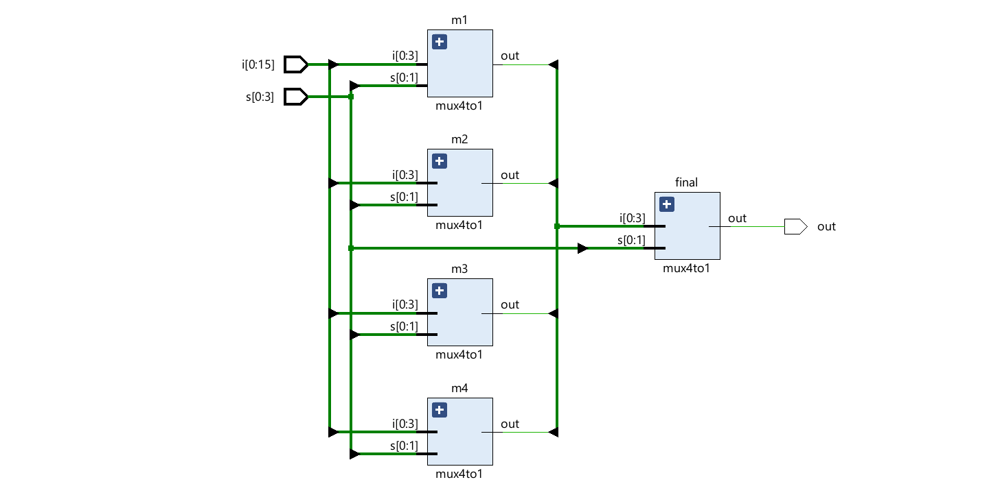

# 🧮 16-to-1 Multiplexer in Verilog

This project implements a **16-to-1 Multiplexer (MUX)** in Verilog using a hierarchical approach — built from multiple **4-to-1 MUX** modules.  
The project includes both the **design code** and **testbench** for simulation in **Xilinx Vivado**.

---

## 📘 Overview

A **Multiplexer (MUX)** is a combinational circuit that selects one of many input signals and forwards the selected input into a single output line.  
This **16:1 multiplexer** uses **four 4:1 MUXes** as building blocks, and then a final **4:1 MUX** to produce the final output.

---

## 🧠 Working Principle

- **Inputs:** 16 data lines (`i[0]` to `i[15]`)
- **Select Lines:** 4 (`s[0]` to `s[3]`)
- **Output:** 1 (`out`)

Each 4:1 MUX selects one input out of four, depending on the first two select bits (`s[0:1]`).  
Then, the final 4:1 MUX selects one of those four outputs using the remaining two select bits (`s[2:3]`).

---

## 🧩 Circuit Diagram



---

## 💻 Verilog Code

### 🔸 `mux16to1.v`

```verilog
`timescale 1ns / 1ps
//////////////////////////////////////////////////////////////////////////////////
// Company: 
// Engineer: 
// 
// Create Date: 08.11.2025 23:58:22
// Design Name: 
// Module Name: mux16to1
// Project Name: 
// Target Devices: 
// Tool Versions: 
// Description: 16-to-1 multiplexer built using 4-to-1 MUX hierarchy
// 
//////////////////////////////////////////////////////////////////////////////////

module mux16to1(
    input [0:15] i,
    input [0:3] s,
    output out
    );
    
    wire [0:3] w;

    mux4to1 m1 (i[0:3], s[0:1], w[0]);
    mux4to1 m2 (i[4:7], s[0:1], w[1]);
    mux4to1 m3 (i[8:11], s[0:1], w[2]);
    mux4to1 m4 (i[12:15], s[0:1], w[3]);

    mux4to1 final (w[0:3], s[2:3], out);
endmodule

module mux4to1(i, s, out);
    input [0:3] i;
    input [0:1] s;
    output reg out;

    always @(*) begin
        case (s)
            2'b00 : out = i[0];
            2'b01 : out = i[1];
            2'b10 : out = i[2];
            2'b11 : out = i[3];
        endcase
    end
endmodule
```

---

## 🧪 Testbench

### 🔸 `tb_mux16to1.v`

```verilog
`timescale 1ns / 1ps
module tb_mux16to1;
    reg [0:15] i;
    reg [0:3] s;
    wire out;

    mux16to1 uut (
        .i(i),
        .s(s),
        .out(out)
    );

    initial begin
        $display("Time\tSelect\tOutput");
        i = 16'b1010_1100_1111_0001;
        s = 4'b0000;
        
        repeat(16) begin
            #10;
            $display("%0t\t%b\t%b", $time, s, out);
            s = s + 1;
        end

        $finish;
    end
endmodule
```

---

## ⚙️ Simulation Output

The simulation verifies that for every change in select input `s`,  
the correct data line from `i` is passed to the output `out`.

| Select (s) | Expected Output |
|-------------|----------------|
| 0000 | i[0] |
| 0001 | i[1] |
| 0010 | i[2] |
| ... | ... |
| 1111 | i[15] |

---

## 🧾 Explanation

- **mux4to1:** Selects one of 4 inputs based on 2-bit selector.  
- **mux16to1:** Uses 4 instances of mux4to1, then one final mux4to1 to pick the final output.  
- **Hierarchical Design:** Reduces complexity and improves modular reusability.  

This structure is widely used in **digital systems**, **ALU design**, and **data routing circuits**.

---

## 🛠️ Tools Used

- **Vivado 2023.1 / 2024.x** (for synthesis and simulation)
- **Verilog HDL**
- **Windows/Linux**

---

## 📂 Project Structure

```
├── mux16to1.v
├── tb_mux16to1.v
├── b8334f38-4e0d-47ff-98da-7d05d9490518.png
└── README.md
```

---

## 🧑‍💻 Author

**Abhisekh Barman**  
📧 [abhisekhbarman688@gmail.com]  
💼 [GitHub Profile](https://github.com/barman9002)

---

## 🏁 Conclusion

This project demonstrates how to **design and simulate a hierarchical 16:1 multiplexer** using Verilog.  
It serves as a great example for **combinational logic design** and **modular hardware coding practices**.
